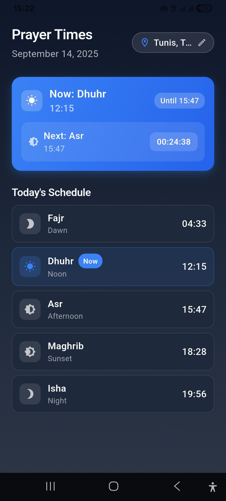
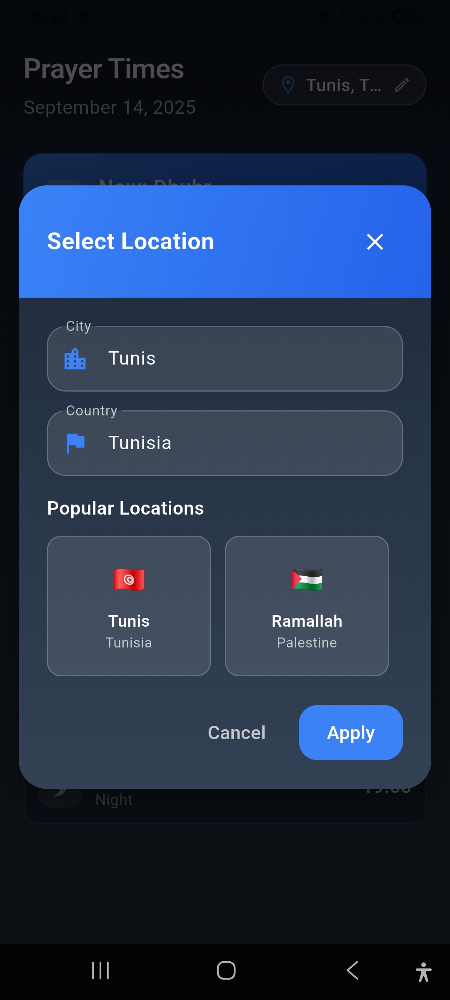

# 🌙 Prayer Times App

A beautiful and intuitive Flutter application that displays Islamic prayer times for any location worldwide. The app features a modern UI with smooth animations and real-time prayer time updates.

<div align="center">
  
</div>

## ✨ Features

- 🕌 Accurate prayer times using the Aladhan API
- 🌍 Search for any city and country worldwide
- ⏰ Real-time countdown to next prayer
- 🎨 Beautiful gradient UI with smooth animations
- 🔄 Pull-to-refresh functionality
- 🌙 Support for all five daily prayers
- 📱 Responsive design for all screen sizes
- 🌙 Dark theme by default
- 📍 Save your favorite locations

## 🚀 Getting Started

### Prerequisites

- Flutter SDK (latest stable version)
- Dart SDK (latest stable version)
- An IDE (Android Studio, VS Code, or IntelliJ IDEA)

### Installation

1. Clone the repository:
   ```bash
   git clone https://github.com/yassindaboussi/PrayerTimesApp.git
   cd prayer-times-app
   ```

2. Install dependencies:
   ```bash
   flutter pub get
   ```

3. Run the app:
   ```bash
   flutter run
   ```

## 🛠️ Dependencies

- `http`: For making API requests to the Aladhan API
- `flutter_lints`: For code quality and style
- `cupertino_icons`: For iOS-style icons

## 📱 Screenshots

<div style="display: flex; flex-wrap: wrap; gap: 10px; justify-content: center;">
  
  
</div>

## 🏗️ Project Structure

```
lib/
├── main.dart              # App entry point
├── prayertime_screen.dart # Main screen with prayer times
├── utils/
│   └── prayer_utils.dart  # Utility functions
└── widgets/
    └── location_selection_dialog.dart # Location selection UI
```

## 🌐 API

This app uses the [Aladhan API](http://aladhan.com/prayer-times-api) to fetch accurate prayer times based on the user's location.

## 🤝 Contributing

Contributions are welcome! Please feel free to submit a Pull Request.

## 📄 License

This project is licensed under the MIT License - see the [LICENSE](LICENSE) file for details.

## 🙏 Acknowledgments

- [Aladhan API](http://aladhan.com/) for providing prayer time data
- Flutter team for the amazing framework
- Open source community for various packages and resources

---

<div align="center">
  Made with ❤️ and Flutter
</div>
